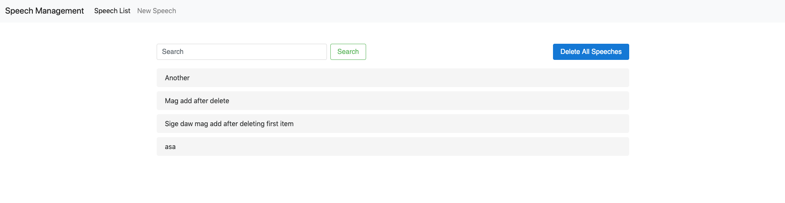
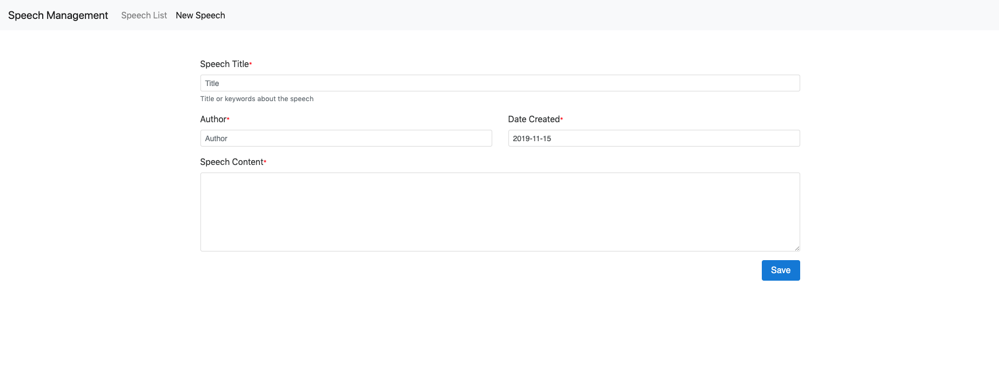
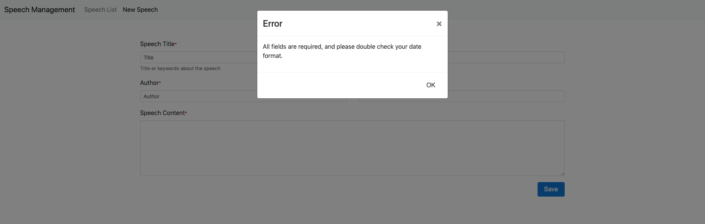
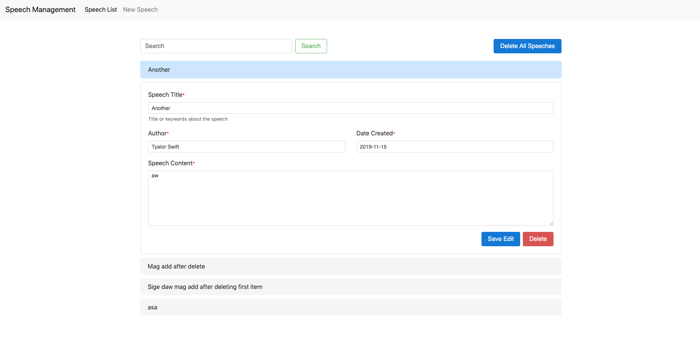
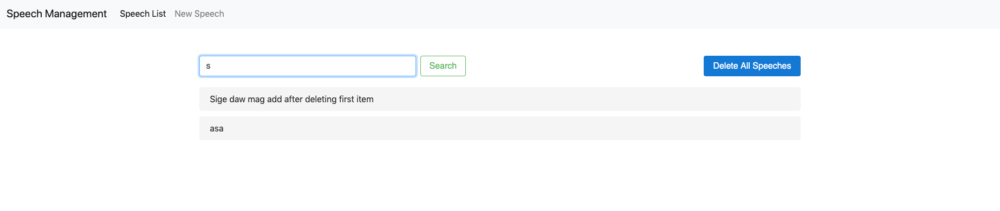

# Speech Management
CRUD for speeches created by politicians in their political career

This project was generated with [Angular CLI](https://github.com/angular/angular-cli) version 8.3.9.

## 1. Install Dependencies

Get into the project with the command `cd speech-mgt` in your terminal.

Assuming Node is already installed in your pc, download the project's dependencies with `npm install`

## 2. Development Server

Run `ng serve` for a dev server. Navigate to `http://localhost:4200/`. The app will automatically reload if you change any of the source files.

If only an error occurs upon running `ng serve`, proceed to step number 3

## 3. Installation of Angular CLI

Input the command `npm install -g @angular/cli` to install Angular CLI

# Project Functions

## List of Speeches

## Create New Speech
All fields are required. When at least 1 field is left empty or the date inputed does not follow correct format, a modal with an error message pops up.

## Edit and Deletion of Speech

## Search Speech

